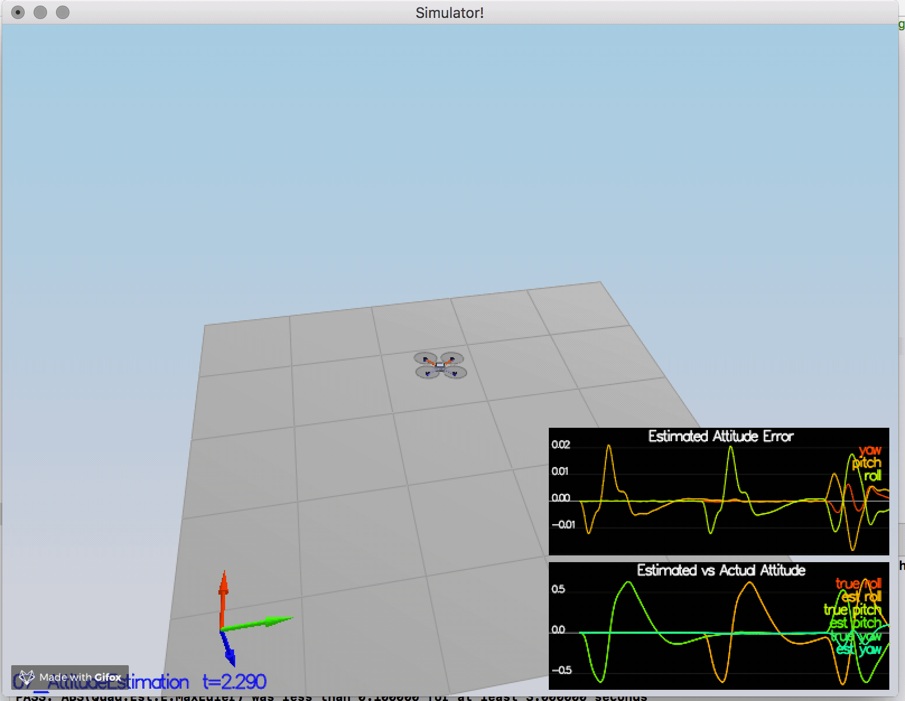

# Estimation Project #

This is part four of the FCND program, in this series we learnt about Estimation and here is the project that implements Extended Kalman Filter. 


## The Tasks ##

Task outline:

 - [Task 1: Sensor Noise](#task-1-sensor-noise)
 - [Task 2: Attitude Estimation](#task-2-attitude-estimation)
 - [Task 3: Prediction Step](#task-3-prediction-step)
 - [Task 4: Magnetometer Update](#task-4-magnetometer-update)
 - [Task 5: Closed Loop + GPS Update](#task-5-closed-loop--gps-update)
 - [Step 6: Adding Your Controller](#task-6-adding-your-controller)


### Task 1: Sensor Noise ###

#### Determine the standard deviation of the measurement noise of both GPS X data and Accelerometer X data.

In the previous project , the simulator was considered to use an 'Ideal' set of sensors. However in reality we need to consider the sensor noise. For this purpose we collected some simulated noisy sensor data and estimated the standard deviation of the quad's sensor.

The logged files `config/log/Graph1.txt` (GPS X data) and `config/log/Graph2.txt` (Accelerometer X data) was processed with the following code to calcuate the their respective standard deviation

 - [Sensor_Noise.py](util/Sensor_Noise.py)
```
import numpy as np

gps_x = np.loadtxt('/FCND-Etimation-CPP/FCND-Estimation-CPP/config/log/Graph1.txt',delimiter=',',dtype='Float64',skiprows=1)[:,1]
acc_x = np.loadtxt('/FCND-Etimation-CPP/FCND-Estimation-CPP/config/log/Graph2.txt',delimiter=',',dtype='Float64',skiprows=1)[:,1]

gps_x_std  = np.std(gps_x)
acc_x_std = np.std(acc_x)

print(f'Accelerometer X Std: {acc_x_std}')
print(f'GPS X Std: {gps_x_std}')
```
The results was then set to the values of `MeasuredStdDev_GPSPosXY` and `MeasuredStdDev_AccelXY`

#### Output

 
*Standard deviation was accurately captured with the value of approximately 68% of the respective measurements.*


### Task 2: Attitude Estimation ###

 In this step, we will be improving the complementary filter-type attitude filter with a better rate gyro attitude integration scheme.

 As per the reference from leaf document , following equations (non-linear complimentary filter for attitude using quaternions) was used for reference.


 And for [UpdateFromIMU()](src/QuadEstimatorEKF.cpp)  function , by using the utility function - FromEuler123_RPY( that was already pre built), following code was implemented 

```

 
    Quaternion<float> quat = Quaternion<float>::FromEuler123_RPY(rollEst, pitchEst, ekfState(6));
    quat.IntegrateBodyRate(gyro, dtIMU);
  
    //float predictedPitch = pitchEst + dtIMU * gyro.y;
    //float predictedRoll = rollEst + dtIMU * gyro.x;
    //ekfState(6) = ekfState(6) + dtIMU * gyro.z;    // yaw
    
    float predictedRoll = quat.Roll();
    float predictedPitch = quat.Pitch();
    ekfState(6) = quat.Yaw();
    
    // normalize yaw to -pi .. pi
    if (ekfState(6) > F_PI) ekfState(6) -= 2.f*F_PI;
    if (ekfState(6) < -F_PI) ekfState(6) += 2.f*F_PI;


```

*A better rate gyro attitude integration scheme was implemented & the attitude errors was within 0.1 rad for each of the Euler angles*

#### Output


### Task 3: Prediction Step ###

In this next step we implemented the prediction step of our filter.

For [PredictState()](src/QuadEstimatorEKF.cpp) function , we have leveraged the utility function attitude.Rotate_BtoI(<V3F>) to rotate a vector from body frame to inertial frame

And the final implementation looks like below.

```
    predictedState(0) += curState(3)*dt;
    predictedState(1) += curState(4)*dt;
    predictedState(2) += curState(5)*dt;
   
    const V3F iner = attitude.Rotate_BtoI(accel) - V3F(0.0F, 0.0F, static_cast<float>(CONST_GRAVITY));
    
    predictedState(3) += iner[0] * dt;
    predictedState(4) += iner[1] * dt;
    predictedState(5) += iner[2] * dt;
```
For [GetRbgPrime()](src/QuadEstimatorEKF.cpp)  below code was implemented

```

    RbgPrime(0,0) = -cos(pitch) * sin(yaw);
    RbgPrime(0,1) = -sin(roll) * sin(pitch) * sin(yaw) - cos(roll) * cos(yaw);
    RbgPrime(0,2) = -cos(roll) * sin(pitch) * sin(yaw) + sin(roll) * cos(yaw);
    
    RbgPrime(1,0) = cos(pitch) * cos(yaw);
    RbgPrime(1,1) = sin(roll) * sin(pitch) * cos(yaw) - cos(roll) * sin(yaw);
    RbgPrime(1,2) = cos(roll) * sin(pitch) * cos(yaw) + sin(roll) * sin(yaw);
    
    RbgPrime(2, 0) =  0;
    RbgPrime(2, 1) =  0;
    RbgPrime(2, 2) =  0;

```
From the above implementation in the leaf document  
 was used as the reference for transition model  

And finally for [Predict()](src/QuadEstimatorEKF.cpp) function below code was implemented
```
    gPrime(0,3) = dt;
    gPrime(1,4) = dt;
    gPrime(2,5) = dt;
    
    gPrime(3,6) = (RbgPrime(0,0) * accel.x + RbgPrime(0,1) * accel.y + RbgPrime(0,1) * accel.z) * dt;
    gPrime(4,6) = (RbgPrime(1,0) * accel.x + RbgPrime(1,1) * accel.y + RbgPrime(1,1) * accel.z) * dt;
    gPrime(5,6) = (RbgPrime(2,0) * accel.x + RbgPrime(2,1) * accel.y + RbgPrime(2,1) * accel.z) * dt;
    
    ekfCov = gPrime * ekfCov * gPrime.transpose() + Q;

```

#### Output 


##### Covariance Prediction


### Task 4: Magnetometer Update ###

  In this step, we have added the information from the magnetometer to improve the filter's performance in estimating the vehicle's heading. 

For [UpdateFromMag()](src/QuadEstimatorEKF.cpp)  below code was implemented

```
    zFromX(0) = ekfState(6);
    float yaw_diff = magYaw - ekfState(6);
    
    if (yaw_diff > F_PI) {
        zFromX(0) += 2 * F_PI;
    } else if (yaw_diff < -F_PI) {
        zFromX(0) -= 2 * F_PI;
    }
    hPrime(6) = 1;
```


Following has been used as the reference from the leaf document 


#### Output


### Task 5: Closed Loop + GPS Update ###
For the GPS update following section from the Leaf Document was referrred.


The partial deriavtive was acheived by the following piece of code 

```
   for (int i = 0; i < 6; ++i)
    {
        zFromX(i) = ekfState(i);
        hPrime(i, i) = 1.0F;
    }

```

#### Output


Apart from the above task , Monte Carlo test provided the following Outputs :)


